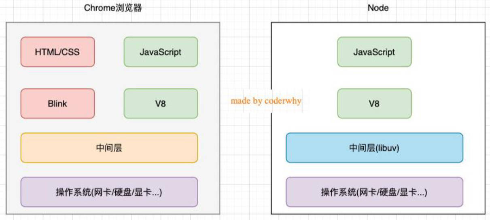
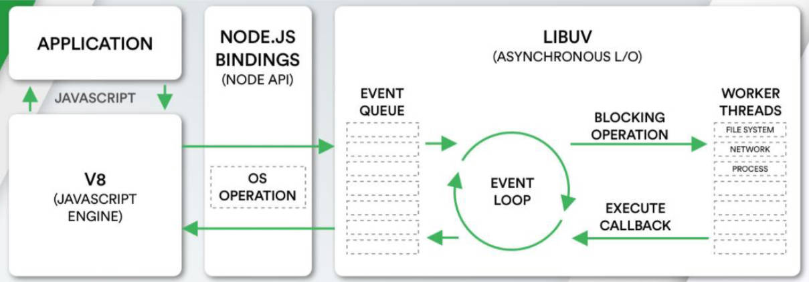

# 一、软件架构图

理解软件开发的架构图。


# 二、Node.js 是什么？

官方对 Node.js 的定义： 一个基于 V8 引擎的 JavaScript 运行时环境。

Node.js 基于 V8 引擎，执行 JavaScript 代码，但 Node.js 不仅仅只有 V8 引擎：

- 我们已知 V8 可以嵌入到任何 C++ 应用程序中；
- 无论是 Chrome 还是 Node.js，都是嵌入了 V8 引擎来执行 JavaScript 代码；
- 事实上，在 Chrome 浏览器中：
  - 还有解析、渲染 HTML、CSS 等相关渲染引擎；
  - 还有支持浏览器操作的 API；
  - 还有浏览器自己的事件循环等；
- 事实上，在 Node.js 中：也提供了系统层面的 API：
  - 比如文件系统读/写、网络 IO、加密、压缩解压文件等操作；

# 三、浏览器对比 Node.js

浏览器和 Node.js 架构的区别。



# 四、Node.js 架构图

在 Node 中，编写的 JavaScript 代码会：

- 经过 V8 引擎编译执行；
- 再通过 Node.js 的 Bindings；
- 将任务放到 Libuv 的事件循环中；

libuv（Unicorn Velociraptor 独角伶盗龙）是使用 C 语言编写的库；

libuv 提供了事件循环、文件系统读写、网络 IO、线程池等等内容；

libuv，将 js 代码，转化成系统操作。



# 五、内置模块 fs

fs 是 **File System** 的缩写，表示文件系统。

对于任何一个，为服务器端服务的语言或者框架，通常都会有自己的文件系统：

服务器需要将各种数据、文件，放置到不同的地方；

- 比如用户数据可能大多数是放到数据库中的；
- 比如某些配置文件，或者静态资源（图片、音视频），是以文件的形式，存储于操作系统上的。

Node 也有自己的文件系统操作模块，就是 fs：

Node 是**跨平台**的，借助于其中封装的文件系统，在任何的操作系统（window、MacOS、Linux）上，可直接去操作文件；

这是 Node 可以开发服务器的一大原因，也是它可以成为前端自动化脚本热门工具的原因；

> 【注意】：”数据“不一定要存储在数据库中，存储在“.txt”文本文件中，也不是不行；只不过，存储在数据库中，读写效率更高。

## 1.文件读取

Node 文件系统 fs 的 API 非常的多：详见[官方文档](https://nodejs.org/docs/latest-v16.x/api/fs.html)；

这些 API，大多数都提供三种操作方式：

- 方式一：同步操作文件：
  - 代码会被阻塞，不会继续执行；
- 方式二：异步回调函数，操作文件：
  - 代码不会被阻塞，需要传入回调函数，当获取到结果时，回调函数被执行；
- 方式三：异步 Promise 操作文件：
  - 代码不会被阻塞，通过 `fs.promises` 调用方法操作，会返回一个 Promise；
  - 可以通过 `then`、`catch` 进行处理；

方式三，方式二，本质上一样，都是异步处理，方式三使用 Promise 更加现代化。

:egg:案例理解：

同步读取方式：

`fs.readFileSync`

01-Node 模块-fs\01_fs 文件读取的 api.js

```js
const fs = require('fs')

/**
 * 默认读取文件，会以二进制显示，而打印出来又会转成十六进制。
 */
const res1 = fs.readFileSync('./aaa.txt')
console.log('res1:', res1)
// res1: <Buffer 48 65 6c 6c 6f 20 46 72 6f 67 20 e4 bd a0 e5 a5 bd e5 95 8a ef bc 8c e6 9d 8e e9 93 b6 e6 b2 b3>

/**
 * 读取文件时，传入编码方式，如 'utf8'，告诉 Node 读取文件时，应该如何解码。
 */
const res2 = fs.readFileSync('./aaa.txt', {
  encoding: 'utf8'
})
console.log('res2:', res2)
// res1: Hello Frog 你好啊，李银河
```

> 【注意】：文件读取时，如果不填写 `encoding`，返回的结果是 Buffer；

异步读取方式（回调函数形式），处理错误的情况。

`fs.readFile(path[, options], callback)`

01-Node 模块-fs\01_fs 文件读取的 api.js

```js
const fs = require('fs')

/**
 * 异步处理，回调方式
 */
fs.readFile(
  './aaa.txt',
  {
    encoding: 'utf8'
  },
  (err, data) => {
    if (err) {
      console.log('读取文件出错，err:', err)
      return
    }

    console.log('res3:', data)
  }
)
console.log('res3 的后续代码执行~')
//res3 的后续代码执行~
//res3: Hello Frog 你好啊，李银河
```

异步读取方式，Promise 形式。

`fs.promises.readFile`

01-Node 模块-fs\01_fs 文件读取的 api.js

```js
/**
 * 异步处理，Promise 方式
 */
fs.promises
  .readFile('./aaa.txt', {
    encoding: 'utf8'
  })
  .then(res => {
    console.log('res4:', res)
  })
  .catch(err => {
    console.log('err:', err)
  })
```

## 2.文件描述符

文件描述符（**File descriptors**），简称 fd；

在常见的操作系统上，对于每个进程，内核都维护着一张“当前打开着的文件和资源”的表格。

> 每一个读取文件的操作，Node 会开启一个进程。

每个打开的文件，都分配了一个称为文件描述符的，简单的**数字**标识符。

在系统层面，所有文件系统操作，都使用这些文件描述符，来标识和跟踪每个文件。

- Windows 系统使用了一个虽然不同但概念上类似的机制来跟踪资源（Node 已屏蔽）。

为了简化用户的工作，Node.js 抽象出操作系统之间的特定差异，并为所有打开的文件，分配一个数字型的文件描述符。

`fs.open()` 方法用于给打开的文件，分配新的文件描述符。一旦被分配，文件描述符可用于：

- 从文件读取数据；
- 向文件写入数据、
- 获取文件的信息。

:egg: 案例理解：

01-Node 模块-fs\02-fs 文件描述符.js

```js
const fs = require('fs')

// 调用 open API，打开文件，传入回调函数，接收 fd。
fs.open('./bbb.txt', (err, fd) => {
  if (err) {
    console.log('打开文件出错，err:', err)
    return
  }

  console.log('fd:', fd)

  // 再通过 fd，做一些其它操作。如：读取文件信息。
  fs.fstat(fd, (err, status) => {
    if (err) {
      console.log('读取文件信息出错，err:', err)
      return
    }

    console.log('fd status:', status)

    // 手动打开文件，不会自动关闭，需要手动关闭。
    fs.close()
  })
})
```

> 真实开发中使用 Promise；演示示例时，用的是回调方式，

以上是读取文件比较完整的过程。

> 【注意】：手动关闭 fs 是因为：Node 服务器中的进程一般不会关闭，要一直提供服务，所以不需要的进程，手动进行关闭。

## 3.文件写入

如果我们希望对文件的内容进行操作，可以使用文件的写入；

同样也有三种方式，同步，异步回调，异步 Promise；

`fs.writeFile(file, data[, options], callback)`，在文件中写入内容。

- `options` 参数（文件读取也可以传）有以下属性：
  - `flag` 写入的方式。
  - `encoding` 字符编码。

### 1.flag 选项

`flag` 的值有很多，详见[官方文档](https://nodejs.org/dist/latest-v14.x/docs/api/fs.html#fs_file_system_flags)

- `w` 打开文件写入，默认值；
- `w+` 打开文件进行读写（可读可写），如果不存在则创建文件；
- `r` 打开文件读写（可读可写），读取文件时的默认值；
- `r+` 打开文件进行读写，如果不存在那么抛出异常；
- `a` append 缩写，表示打开要写入的文件，将流放在文件末尾。如果不在则创建文件；
- `a+` 打开文件以进行读写（可读可写），将流放在文件末尾。如果不存在则创建文件。

### 2.encoding 选项

关于字符编码的概念，详见[此处](https://www.jianshu.com/p/899e749be47c)；

目前基本用的都是 UTF-8 编码；

:egg: 案例理解：

01-Node 模块-fs\03-fs 文件写入.js

```js
const fs = require('fs')

const content = 'Hello Frog, Mu name is zzt'

fs.writeFile(
  './ccc.txt',
  content,
  {
    encoding: 'utf8',
    flag: 'a'
  },
  err => {
    if (err) {
      console.log('文件写入错误, err:', err)
    } else {
      console.log('文件写入成功')
    }
  }
)
```

## 4.文件夹操作

### 1.创建

`fs.mkdir`

01-Node 模块-fs\04-fs 文件夹创建.js

```js
const fs = require('fs')

fs.mkdir('./zzt', err => {
  console.log('创建文件夹出错，err:', err)
})
```

### 2.读取内容

`fs.readdir`

读取直接子级的内容。

01-Node 模块-fs\05-fs 文件夹内容读取.js

```js
const fs = require('fs')

fs.readdir('./zzt', (err, files) => {
  if (err) {
    console.log('读取文件出错，err:', err)
  }
  console.log('files:', files)
  // files: [ 'aaa', 'bbb', 'nba.txt' ]
})
```

判断直接子级的内容，是文件夹，还是文件。

01-Node 模块-fs\05-fs 文件夹内容读取.js

```js
const fs = require('fs')

fs.readdir('./zzt', { withFileTypes: true }, (err, files) => {
  if (err) {
    console.log('读取文件出错，err:', err)
  }

  console.log('files:', files)
  // files: [
  // 	Dirent { name: 'aaa', [Symbol(type)]: 2 },
  // 	Dirent { name: 'bbb', [Symbol(type)]: 2 },
  // 	Dirent { name: 'nba.txt', [Symbol(type)]: 1 }
  // ]

  files.forEach(item => {
    if (item.isDirectory()) {
      console.log(item.name, '是一个文件夹')
    } else {
      console.log(item.name, '是一个文件')
    }
  })
})
```

递归读取文件夹中所有的文件。

01-Node 模块-fs\05-fs 文件夹内容读取.js

```js
const fs = require('fs')

const readDirectoryFile = path => {
  fs.readdir(path, { withFileTypes: true }, (err, files) => {
    files.forEach(item => {
      if (item.isDirectory()) {
        readDirectoryFile(`${path}/${item.name}`)
      } else {
        console.log('获取到文件:', item.name)
      }
    })
  })
}
readDirectoryFile('./zzt')
```

### 3.重命名

文件夹、文件，都可以重命名。

`fs.rename`

01-Node 模块-fs\06-fs 文件夹重命名.js

```js
const fs = require('fs')

// 对文件夹重命名
fs.rename('./zzt', './kobe', err => {
  if (err) {
    console.log('重命名文件夹出错，err:', err)
    return
  }

  console.log('重命名文件夹完成')
})

// 对文件重命名
fs.rename('./ccc.txt', './ddd.txt', err => {
  if (err) {
    console.log('重命名文件夹出错，err:', err)
    return
  }
  console.log('重命名文件夹完成')
})
```

> Vue、React 项目打包，本质上也是使用 Node 写入文件。

# 六、events 模块

Node 中，很多核心 API，都基于 events 事件驱动；

- 比如 stream，http。
- 在 http 中，request 监听文件传输时，是以”流“来一段一段传输的，

Node 中，events 异步事件驱动，这个体系中：

- 发射器（Emitters）发出某一个事件；
- 监听器（Listeners）监听这个事件，并且传入的回调函数，会在监听到事件时调用；

### 1.基本使用

发出事件和监听事件，都是通过 EventEmitter 类来完成的，它们都属于 events 对象。

- `emitter.on(eventName, listener)`：监听事件，也可以使用 `addListener`；
- `emitter.off(eventName, listener)`：移除事件监听，也可以使用 `removeListener`；
- `emitter.emit(eventName[, ...args])`：发出事件，可以携带一些参数；

:egg: 案例理解：

02-Node 模块-evnet\01-基本使用.js

```js
const EventEmitter = require('events') // 导入 events 模块中的事件总线

// 创建 EventEmitter 的实例
const emitter = new EventEmitter()

const handleZzt = (name, age, height) => {
  console.log('监听到 zzt 事件', name, age, height)
}

emitter.on('zzt', handleZzt)

setTimeout(() => {
  emitter.emit('zzt', 'Zt2tzzt', 18, 1.88)

  emitter.off('zzt', handleZzt)
}, 2000)
```

### 2.其它常见方法

EventEmitter 的实例有一些属性，可通过 API 获取；

- `emitter.eventNames()`：返回当前 EventEmitter 对象注册的事件名称（字符串）数组；
- `emitter.getMaxListeners()`：返回当前 EventEmitter 对象的最大监听器数量。
  - 可以通过 `setMaxListeners()` 来修改，默认是 `10`；
- `emitter.listenerCount(事件名称)`：返回当前 EventEmitter 对象某个事件，对应监听器的个数；
- `emitter.listeners(事件名称)`：返回当前 EventEmitter 对象某个事件,对应监听器数组；

:egg: 案例理解：

02-Node 模块-evnet\02-其它 API（一）.js

```js
const EventEmitter = require('events')

const ee = new EventEmitter()

ee.on('zzt', () => {})
ee.on('zzt', () => {})
ee.on('zzt', () => {})

ee.on('kobe', () => {})
ee.on('kobe', () => {})

// 1.获取所有监听事件的名称
console.log(ee.eventNames())
// [ 'zzt', 'kobe' ]

// 2.获取监听最大的监听个数
console.log(ee.getMaxListeners())
// 10

// 3.获取某一个事件名称对应的监听器个数
console.log(ee.listenerCount('zzt'))
// 3

// 4.获取某一个事件名称对应的监听器函数(数组)
console.log(ee.listeners('zzt'))
// [
//   [Function (anonymous)],
//   [Function (anonymous)],
//   [Function (anonymous)]
// ]
```

EventEmitter 的实例方法补充：

- `emitter.once(eventName, listener)`：事件监听一次；
- `emitter.prependListener(eventName, listener)`：将监听事件添加到最前面；
- `emitter.prependOnceListener(eventName, listener)`：将监听事件添加到最前面，但是只监听一次；
- `emitter.removeAllListeners([eventName])`：移除所有的监听器。

:egg: 案例理解：

02-Node 模块-evnet\03-其它 API（二）.js

```jsx
const EventEmitter = require('events')

const ee = new EventEmitter()

// 1.once: 事件监听只监听一次(第一次发射事件的时候进行监听)
ee.once('zzt', () => {
  console.log('on监听 zzt1') // 后打印
})

// 2.prependListener: 将事件监听添加到最前面
ee.prependListener('zzt', () => {
  console.log('on监听 zzt2') // 先打印
})

ee.emit('zzt')

// 3.移除所有的事件监听
// 不传递参数的情况下, 移除所有事件名称，对应的所有事件监听
// 在传递参数的情况下, 只会移除传递的事件名称，对应的事件监听
ee.removeAllListeners('zzt')
```
