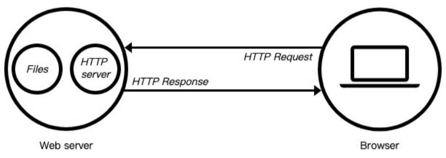

# 一、Web 服务器是社么？

当应用程序（客户端）需要某一个资源时，通过 Http 请求，向一台服务器，获取到这个资源；

提供资源的这个服务器，就是一个 Web 服务器；



目前有很多开源的 Web 服务器：

- 比如 Nginx；
- 比如 Apache（静态）、Apache Tomcat（静态、动态）；
- 比如 Node.js
- ...

Nods 有 `http` 模块，通常使用基于该模块的框架，如 _express_、_koa_，开发服务器。

# 二、http 模块

在 Node 中，提供 web 服务器的资源，返回给浏览器，主要是通过 `http` 模块完成的。

## 1.创建服务器

创建服务器对象，是通过 `http.createServer` 方法来完成的。

- 该方法会返回服务器的对象 `server`；
- 底层其实使用的是 `new Server` 创建的一个对象。

05-Node 服务器-http\01-http 创建服务器基本使用.js

```js
const http = require('http')

// 创建一个 http 对应的服务器
const server = http.createServer((request, response) => {
  response.end('Hello World')
})
```

当然，我们也可以自己来创建这个对象：

```js
const server = new http.Server((req, res) =? {
  res.end('Hello World')
})
```

上面我们已经知道，创建 Server 时会传入一个回调函数，这个回调函数在被调用时会传入两个参数：

- `request` 请求对象，包含请求相关的信息；本质上是一个可读流 readable；
- `response` 响应对象，包含我们要发送给客户端的信息；本质上是一个可写流 writeable。

## 2.开启服务器

`server.listen` 方法，用于开启服务器；并且在某一个主机地址的端口上，监听网络请求：

- 也就是说，当通过 [ip]:[port] 的方式，发送请求到监听的 Web 服务器上时；就可以对其进行相关的处理了。

`listen` 方法，有三个参数：

- `port`: 端口，可以不传, 系统会默认分配,（项目中通常会定义一个全局环境变量）；
  - 比如：nginx 服务器，默认监听 `80` 端口。
- `host`：主机， 通常不传，默认 `0.0.0.0`:
  - `localhost`：本质上是一个域名，通常情况下会被解析成 `127.0.0.1`；
  - `127.0.0.1`：回环地址（Loop Back Address），表达的意思是“主机自己发出去的包，直接被自己接收”；
    - 网络请求中的数据包，一般经过：应用层 - 传输层 - 网络层 - 数据链路层 - 物理层；
    - 而回环地址发送的数据包，在“网络层”直接就被获取到了，是不会经过“数据链路层”和“物理层“的；
    - 比如我们监听 `127.0.0.1` 时，在同一个网段下的主机中，通过 ip 地址是不能访问的；
  - `0.0.0.0`：监听 IPV4 上所有的地址，再根据端口找到不同的应用程序；
    - 比如我们监听 `0.0.0.0` 时，在同一个网段下的主机中，通过 ip 地址是可以访问的；
- callback：服务器启动成功时的回调函数；

:egg: 案例理解：

05-Node 服务器-http\01-http 创建服务器基本使用.js

```js
const http = require('http')

// 创建一个 http 对应的服务器
const server = http.createServer((request, response) => {
  response.end('Hello World')
})

// 开启服务器，指定监听的端口。
server.listen(8000, () => {
  console.log('服务器看起成功了~')
})
```

一旦监听端口，Node 线程将阻塞，等待客户端请求。

> 【注意】：
>
> 一般要开启服务器，要监听 `(1024，65535]` 之间的端口。
>
> - 监听小于等于 1024 的端口，可能会覆盖系统的某些特殊服务端口。
>
> 通常操作系统使用两个字节，表示端口；
>
> - 即最大端口是 `255 * 255 = 65536`，即 `0 - 65535` 之间的端口。

## 3.创建多个服务

一个主机（云主机）中，可以创建多个服务器；

每个服务器监听不同的端口，提供不同的服务。

05-Node 服务器-http\02-http 创建多个服务器.js

```js
const http = require('http')

// 1.创建第一个服务器
const server1 = http.createServer((req, res) => {
  res.end('2000 端口的服务器返回的结果~')
})
server1.listen(2000, () => {
  console.log('2000端口对应的服务器启动成功~')
})

// 2.创建第二个服务器
const server2 = http.createServer((req, res) => {
  res.end('3000端口服务器返回的结果~')
})
server2.listen(3000, () => {
  console.log('3000端口对应的服务器启动成功~')
})
```

# 三、Postman 工具

对服务器接口进行测试时，一般使用专业的测试工具， 如 Postman；

如果使用浏览器进行测试，会有很多干扰因素。

- 比如：创建一个服务器，如果使用浏览器访问，默认会访问两次

  - 一次访问访问开启服务的端口。
  - 一次访问 favicon.ico 图标。

- 浏览器没法测试 post 请求。

# 四、nodemon 依赖

node 开启了一个服务器，如果又修改了服务器中的代码逻辑，需要手动重启服务器，才能生效。

安装一个依赖 _nodemon_(node monitor 的缩写）用于 node 服务器的自动重启。

```shell
npm install nodemon -g

nodemon xxx.js
```

> 【补充】：将创建服务器，开启服务器，的代码，创建一个代码片段。快速生成。
>
> C:\Users\MyName\AppData\Roaming\Code\User\snippets\javascript.json
>
> ```json
> {
>   "http server": {
>     "prefix": "http-server",
>     "body": [
>       "const http = require('http')",
>       "",
>       "const server = http.createServer((req, res) => {",
>       "  response.end('Hello World')",
>       "})",
>       "",
>       "server.listen(8000, () => {",
>       "  console.log('服务器看起成功了~')",
>       "})"
>     ],
>     "description": "http server"
>   }
> }
> ```

# 五、request 对象

在向服务器发送请求时，我们会携带很多信息，比如：

- 本次请求的 `url`；服务器根据不同的 URL 进行不同的处理；
- 本次请求的请求方式 `method`，服务器对 GET、POST 请求传入的参数和处理的方式是不同的；
- 本次请求的 `headers` 中也会携带一些信息，
  - 比如客户端信息、接受数据的格式、支持的编码格式等等；
- 等等。

这些信息，Node 会封装到一个 `request` 的对象中，方便开发者进行处理。

05-Node 服务器-http\03-http 服务器-request 对象.js

```js
const http = require('http')

// 1.创建 server 服务器
const server = http.createServer((req, res) => {
  // request 对象中包含以下常用的信息：
  // 1.url 信息
  // 2.method 信息(请求方式)
  // 3.headers 信息(请求信息)

  console.log(req.url)
  // /

  console.log(req.method)
  // GET

  console.log(req.headers)
  // {
  // 	'user-agent': 'PostmanRuntime/7.31.1',
  // 	accept: '*/*',
  // 	'postman-token': '6b4b4127-1eff-43db-8b52-f39aec4278d9',
  // 	host: 'localhost: 8000',
  // 	'accept-encoding': 'gzip, deflate, br',
  // 	connection: 'keep-alive'
  // }

  res.end('hello world aaaa')
})

// 2.开启 server 服务器
server.listen(8000, () => {
  console.log('服务器开启成功~')
})
```

# 六、url 处理

## 1.路径处理

客户端在发送请求时，会请求不同的数据，那么会传入不同的请求地址：

- 比如 `http://localhost:8000/login`
- 比如 `http://localhost:8000/products`

服务器端需要根据不同的请求地址，做出不同的响应：

04-Node 服务器-http\05-http 服务器-区分不同 url.js

```js
const http = require('http')

// 1.创建 server 服务器
const server = http.createServer((req, res) => {
  const url = req.url

  if (url === '/login') {
    res.end('登录成功~')
  } else if (url === '/products') {
    res.end('商品列表~')
  } else if (url === '/lyric') {
    res.end('天空好想下雨, 我好想住你隔壁!')
  }
})

// 2.开启 server 服务器
server.listen(8000, () => {
  console.log('服务器开启成功~')
})
```

## 1.query 字符处理

客户端发送的请求 url 中，经常携带一些额外的参数：

比如这个请求地址：`http://localhost:8000/login?name=zzt&password=123`

url 的值是 `/login?name=why&password=123`；其中的 query 字符串，处理步骤如下：

1. 取到 query 字符串；
   - 引入 `url` 模块，使用 `parse` 方法，
2. 解析 query 字符串；有两种方式。
   - 方式一：引入 `qureystring` 模块，使用 `parse` 方法；
   - 方式二：使用 `URLSearchParams` 推荐。

:egg: 案例理解：

05-Node 服务器-http\05-request-url-query 参数处理.js

```js
const http = require('http')
const url = require('url')
const qs = require('querystring')

// 1.创建server服务器
const server = http.createServer((req, res) => {
  // 解析 url /home/list?offset=100&size=20

  // 1.取到 query 字符串。
  const urlString = req.url
  const urlInfo = url.parse(urlString)
  const queryString = urlInfo.query

  // 2.解析 query string: offset=100&size=20

  // 方式一：
  /* const queryInfo = qs.parse(queryString)
  console.log(queryInfo.offset, queryInfo.size) */

  // 方式二（推荐）：
  const queryInfo = new URLSearchParams(queryString) // 返回 Entries 数据结构
  console.log(queryInfo.get('offset'), queryInfo.get('size'))
  // 100 20
  console.log(Object.fromEntries(queryInfo))
  // { offset: '100', size: '20' }

  res.end('hello world aaaa bbb')
})

// 2.开启server服务器
server.listen(8000, () => {
  console.log('服务器开启成功~')
})
```

# 七、method 的处理

在 Restful 规范（设计风格）中，对于数据的增删改查，应该通过不同的请求方式：

- `GET`：查询数据；
- `POST`：新建数据；
- `PATCH`：更新数据；
- `DELETE`：删除数据；

判断不同的请求方式，进行不同的处理。

05-Node 服务器-http\06-http 服务器-区分不同 method.js

```js
const http = require('http')

// 1.创建 server 服务器
const server = http.createServer((req, res) => {
  const url = req.url
  const method = req.method

  if (url === '/login') {
    if (method === 'POST') {
      res.end('登录成功~')
    } else {
      res.end('不支持的请求方式, 请检测你的请求方式~')
    }
  } else if (url === '/products') {
    res.end('商品列表~')
  } else if (url === '/lyric') {
    res.end('天空好想下雨, 我好想住你隔壁!')
  }
})

// 2.开启 server 服务器
server.listen(8000, () => {
  console.log('服务器开启成功~')
})
```

> 【补充】：在框架（如 _express_）中，封装了 `method` 和 `url` 结合的处理。

# 八、body 参数的获取

使用 POST 请求传递参数的接口，参数在 body 请求体中。

现有一个创建用户的接口：

- 请求路径 `url` 为 `/users`；
- 请求方式 `method` 为 `POST`；
- body 体中携带数据 `username`和`password`；

`reuqest` 对象中，不能直接取到 body 请求体；需要通过监听 `reqest` 的 `"data"` 事件，获取 body 请求体。

> 【注意】：`request` 对象，本质上是一个 readable 可读流。

05-Node 服务器-http\07-request-body 参数.js

```js
const http = require('http')

// 1.创建 server 服务器
const server = http.createServer((req, res) => {
  // 获取参数: body 参数
  req.setEncoding('utf-8')

  // request 对象本质是上一个 readable 可读流
  let isLogin = false
  req.on('data', dataString => {
    const loginInfo = JSON.parse(dataString)
    if (loginInfo.name === 'zzt' && loginInfo.password === '123') {
      isLogin = true
    } else {
      isLogin = false
    }
  })

  req.on('end', () => {
    if (isLogin) {
      res.end('登录成功, 欢迎回来~')
    } else {
      res.end('账号或者密码错误, 请检测登录信息~')
    }
  })
})

// 2.开启 server 服务器
server.listen(8000, () => {
  console.log('服务器开启成功~')
})
```

# 九、HTTP Request Header

> 【回顾】：HTTP Request Header 相关知识。

在 `request` 对象的 `header` 属性中，也包含很多有用的信息，客户端会默认传递过来一些信息：比如：

```yaml
Accept: '/'
Accept-Encoding: gzip, deflate
Accept-Language: zh-CN,zh;q=0,9
Access-Control-Request-Headers: token
Access-Control-Request-Method: POST
Connection: keep-alive
Host: 192.168.0.110:1888
Origin: http://127.0.0.1:5500
Referer: http://127.0.0.1:5500/
Sec-Fetch-Mode: cors
User-Agent: Mozilla/5.0 (Windows NT 10.0; Win64; x64) AppleWebKit/537.36 (KHTML, like Gecko) Chrome/111.0.0.0 Safari/537.36
```

其中：

`content-type`：请求携带的数据的类型，包括以下取值：

- `application/x-www-form-urlencoded`：表示数据被编码成以 '&' 分隔的键值对，同时以 '=' 分隔键和值。
- `application/json`：表示是一个 json 类型；
- `text/plain`：表示是文本类型；
- `application/xml`：表示是 xml 类型；
- `multipart/form-data`：表示是上传文件；

`content-length`：文件的大小长度，可用于判断文件是否适合一次性读取。

`connection: keep-alive`：是否保持连接；

- http 是基于 TCP 协议的，通常在进行一次请求和响应结束后会立刻中断；
- 在 http1.0 中，如果想要继续保持连接：

  - 浏览器需要在请求头中添加 `connection: keep-alive`；
  - 服务器需要在响应头中添加 `connection: keey-alive`；
  - 当客户端再次放请求时，就会使用同一个连接，直到一方中断连接；

- 在 http1.1 中，所有连接默认是 `connection: keep-alive` 的；
  - 不同的 Web 服务器，会有不同的保持 `keep-alive` 的时间；
  - Node 中默认是 5s；

`accept-encoding`：告知服务器，客户端支持的文件压缩格式，比如 js 文件可以使用 gzip 编码，对应 .gz 文件；

`accept`：告知服务器，客户端可接受文件的格式类型；

`user-agent`：客户端相关的信息；

:egg: 案例理解：

在服务器中，获取请求携带的 token；

在 postmen 中，选择默认的授权方式，如 ”Bearer Token“，token 会被自动放入请求头中；

在 `req.header.authoritarian` 中获取：

05-Node 服务器-http\08-request-header 参数.js

```js
const http = require('http')

// 1.创建server服务器
const server = http.createServer((req, res) => {
  console.log(req.headers)
  // {
  // 	authorization: 'Bearer abc123',
  // 	'content-type': 'application/json',
  // 	'user-agent': 'PostmanRuntime/7.31.1',
  // 	accept: '*/*',
  // 	'postman-token': 'c7c5686d-f2a6-44c8-819f-f06251669114',
  // 	host: 'localhost: 8000',
  // 	'accept-encoding': 'gzip, deflate, br',
  // 	connection: 'keep-alive',
  // 	'content-length': '39'
  // }

  console.log(req.headers['content-type'])
  // application/json

  // 后续会介绍 cookie/session/token 在服务器开发中的处理方式
  const token = req.headers['authorization']
  console.log(token)

  res.end('查看 header 的信息~')
})

// 2.开启server服务器
server.listen(8000, () => {
  console.log('服务器开启成功~')
})
```

# 十、返回响应结果

给客户端返回响应的结果数据，可通过两种方式：

- `response.write` 方法：这种方式是直接写出数据，但是并没有关闭流；
- `response.end` 方法：这种方式是写出最后的数据，并且写出后会关闭流；

如果没有调用 `end` 方法，客户端将会一直等待结果：

- 所以客户端在发送网络请求时，都会设置超时时间。

05-Node 服务器-http\09-response-响应方式.js

```js
const http = require('http')

// 1.创建server服务器
const server = http.createServer((req, res) => {
  // res: response 对象 => 本质是 Writable 可写流

  // 1.响应数据方式一: write
  res.write('Hello World')
  res.write('哈哈哈哈')

  // // 2.响应数据方式二: end
  res.end('本次写出已经结束')
})

// 2.开启server服务器
server.listen(8000, () => {
  console.log('服务器开启成功~')
})
```

> 【注意】：response 本质上是一个 writeable 可写流。

> 【回顾】：response 特殊之处，没有 `close` 方法，只能调用 `end` 方法结束。

# 十一、返回状态码

Http 状态码（Http Status Code）用来表示 Http 响应状态的数字代码：

Http 状态码非常多，可以根据不同的情况，给客户端返回不同的状态码；

常见状态码：

| 状态码 | 描述                  | 说明                                               |
| ------ | --------------------- | -------------------------------------------------- |
| 200    | OK                    | 客户端请求成功                                     |
| 201    | Created               | POST 请求，创建新的资源                            |
| 301    | Moved Permanently     | 请求资源的 URL，已经修改，响应中会给出新的 URL     |
| 400    | Bad Request           | 客户端错误，服务器无法处理。                       |
| 401    | Unauthorized          | 未授权的请求。                                     |
| 403    | Forbidden             | 没有权限访问。                                     |
| 404    | Not Found             | 服务器找不到请求资源                               |
| 500    | Internal Server Error | 服务器出现无法处理的错误                           |
| 503    | Service Unavailable   | 服务器不可用，可能处于维护或重载状态，暂时无法访问 |

详见 [MDN 响应码解析](https://developer.mozilla.org/zh-CN/docs/web/http/status)

设置状态码有两种方式：

- `res.resstatusCode` 属性指定；
- `res.writeHeaded` 方法。

05-Node 服务器-http\10-response-响应状态码.js

```js
const http = require('http')

// 1.创建server服务器
const server = http.createServer((req, res) => {
  // 响应状态码
  // 1.方式一: statusCode
  // res.statusCode = 403

  // 2.方式二: setHead 响应头
  res.writeHead(401)

  res.end('hello world aaaa')
})

// 2.开启 server 服务器
server.listen(8000, () => {
  console.log('服务器开启成功~')
})
```

# 十二：响应头文件

返回头部信息，主要有两种方式：

- 方式一：`res.setHeader`：一次写入一个头部信息；
- 方式二：`res.writeHead`：同时写入 status 状态码和 header 信息；

Header 设置 `Content-Type ` 有什么作用呢？

- 默认客户端接收到的是字符串，客户端会按照自己默认的方式进行处理；

在 `Cntent-Type` 中，指定返回的数据格式，和字符编码。

> 【注意】：`header` 中的属性信息，是大小写敏感的。

05-Node 服务器-http\11-response-响应 header.js

```js
const http = require('http')

// 1.创建server服务器
const server = http.createServer((req, res) => {
  // 设置 header 信息: 数据的类型以及数据的编码格式
  
  // 1.方式一：单独设置某一个 header
  // res.setHeader('Content-Type', 'text/plain;charset=utf8;')

  // 2.方式二：和 http status code 一起设置
  res.writeHead(200, {
    'Content-Type': 'application/json;charset=utf8;'
  })

  const list = [
    { name: 'zzt', age: 18 },
    { name: 'kobe', age: 30 }
  ]
  res.end(JSON.stringify(list))
})

// 2.开启 server 服务器
server.listen(8000, () => {
  console.log('服务器开启成功~')
})
```
