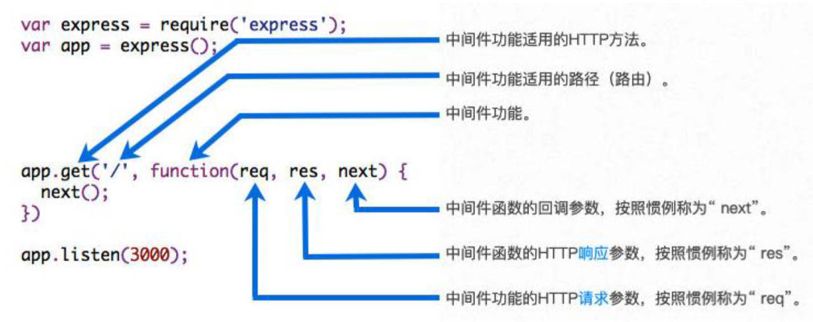

# 一、http 发送请求

我们知道，axios 库，既可以在浏览器中使用，也可以在 Node 中使用。

- 在浏览器中，axios 基于 xhr 技术进行封装。
- 在 Node 中，没有 xhr 技术，axios 是基于 http 内置模块进行封装的；

在 Node 环境下，安装 axios 依赖，使用 axios，发送一个网络请求。

05-Node 服务器-http\12-axios 发送网络请求.js

```js
const axios = require('axios')

axios.get('http://localhost:8000').then(res => {
  console.log('res.data:', res.data)
  // [ { name: 'zzt', age: 18 }, { name: 'kobe', age: 30 } ]
})
```

使用 http 模块 `get` 方法，发送一个 GET 请求；

05-Node 服务器-http\13-http 模块发送网络请求.js

```js
const http = require('http')

http.get('http://localhost:8000', res => {
  // res 本质是可读流，从中读取数据
  res.on('data', data => {
    const dataString = data.toString()
    console.log('dataString:', dataString)
    // [{"name":"zzt","age":18},{"name":"kobe","age":30}]

    const dataInfo = JSON.parse(dataString)
    console.log('datainfo:', dataInfo)
    // [ { name: 'zzt', age: 18 }, { name: 'kobe', age: 30 } ]
  })
})
```

> 【注意】：回调函数中，传入的是 `res` 对象，本质上是可读流。

使用 http 模块的 `request` 方法，发送 POST 请求。

05-Node 服务器-http\13-http 模块发送网络请求.js

```js
const http = require('http')

const req = http.request(
  {
    method: 'POST',
    hostname: 'localhost',
    port: 8000
  },
  res => {
    res.on('data', data => {
      const dataString = data.toString()
      console.log('dataString:', dataString)
      // [{"name":"zzt","age":18},{"name":"kobe","age":30}]

      const dataInfo = JSON.parse(dataString)
      console.log('datainfo:', dataInfo)
      // [ { name: 'zzt', age: 18 }, { name: 'kobe', age: 30 } ]
    })
  }
)

req.end() //  req 对象，本质上是可写流，必须要关闭，否则发送请求无效。
```

> 【注意】：`request` 方法返回的 `req` 对象，本质上是可写流。

# 二、文件上传

真实开发中，后端（不管是 Node 还是 Java）自行处理文件上传，会非常复杂繁琐，一般借助于插件完成。

为了解文件上传的完整过程，在此做一个自行文件上传处理的演示。

在客户端，如浏览器，一般都是通过表单（form）的形式，进行文件上传的；

- 可使用 `<input type="file">` 元素，让用户上传文件。

测试时，使用 postman 模拟文件上传。

- 使用 POST 方法，
- 填写 url，
- 文件放在 Body 请求体中。选择 form-data 数据格式，类型选择 File。

## 1.错误示例

以下是一个文件上传的完整流程，但是是错误的示范：

05*Node 服务器-http\15*文件上传-错误的做法.js

```js
const http = require('http')
const fs = require('fs')

// 创建服务器
const server = http.createServer((req, res) => {
  // 创建一个可写流，将读取到的数据，直接保存下来。
  const writeStream = fs.createWriteStream('./foo.jpg', {
    flags: 'a+'
  })

  // 客户端传过来的是表单数据，在 body 请求体中
  req.on('data', data => {
    console.log('data:', data)
    /* data: <Buffer 2d 2d 2d 2d 2d 2d 2d 2d 2d 2d 2d 2d 2d 2d 2d 2d 2d 2d 2d 2d 2d 2d 2d 2d 2d 2d 2d 2d 36 38 34 30 35 36 35 36 32 38 32 30 39 37 31 35 30 34 34 39 34 35 ... 65133 more bytes>
    data: <Buffer 64 a7 8d a0 a4 94 15 c0 1b 41 57 02 0c 54 7e 92 b5 69 6e 3b 95 b8 09 6e d6 c1 a5 3e f2 97 cc 77 2a de 01 05 43 ee 6d 0b 20 f1 e1 e7 58 45 61 8e 0d 12 ... 65486 more bytes>
    data: <Buffer fc e2 50 73 0d aa df 94 85 e9 8a 5e 98 ae 43 a0 a7 1b f1 f8 7d 69 3a ad bd 3e 7f 23 fd ab 84 38 23 78 22 1a a6 29 14 7d e1 f1 fc 8d 3d 50 a8 65 22 99 ... 65486 more bytes>
    data: <Buffer 64 03 c9 1c c0 e6 ad 52 d4 97 02 4e c4 a9 c5 a8 a6 24 c1 51 52 47 59 10 20 47 1d 2a 71 87 08 71 3b 5e 65 82 cb 4b 59 2e b9 b0 a9 29 4a a5 09 9f bc 16 ... 35064 more bytes> */
    writeStream.write(data)
  })

  req.on('end', () => {
    writeStream.close()
    res.end('文件上传成功~')
  })
})

// 开启服务器
server.listen(8000, () => {
  console.log('服务器开启成功~')
})
```

在其中，加入文件上传进度显示的功能，返回给客户端。

05*Node 服务器-http\15*文件上传-错误的做法.js

```js
const http = require('http')
const fs = require('fs')

// 创建服务器
const server = http.createServer((req, res) => {
  // 创建一个可写流。
  const writeStream = fs.createWriteStream('./foo.jpg', {
    flags: 'a+'
  })

  // 进度显示
  const fileSize = req.headers['content-length']
  console.log('fileSize:', fileSize)
  let countSize = 0

  // 客户端传过来的是表单数据，在 body 请求体中
  req.on('data', data => {
    console.log('data:', data)
    /* data: <Buffer 2d 2d 2d 2d 2d 2d 2d 2d 2d 2d 2d 2d 2d 2d 2d 2d 2d 2d 2d 2d 2d 2d 2d 2d 2d 2d 2d 2d 36 38 34 30 35 36 35 36 32 38 32 30 39 37 31 35 30 34 34 39 34 35 ... 65133 more bytes>
    data: <Buffer 64 a7 8d a0 a4 94 15 c0 1b 41 57 02 0c 54 7e 92 b5 69 6e 3b 95 b8 09 6e d6 c1 a5 3e f2 97 cc 77 2a de 01 05 43 ee 6d 0b 20 f1 e1 e7 58 45 61 8e 0d 12 ... 65486 more bytes>
    data: <Buffer fc e2 50 73 0d aa df 94 85 e9 8a 5e 98 ae 43 a0 a7 1b f1 f8 7d 69 3a ad bd 3e 7f 23 fd ab 84 38 23 78 22 1a a6 29 14 7d e1 f1 fc 8d 3d 50 a8 65 22 99 ... 65486 more bytes>
    data: <Buffer 64 03 c9 1c c0 e6 ad 52 d4 97 02 4e c4 a9 c5 a8 a6 24 c1 51 52 47 59 10 20 47 1d 2a 71 87 08 71 3b 5e 65 82 cb 4b 59 2e b9 b0 a9 29 4a a5 09 9f bc 16 ... 35064 more bytes> */

    writeStream.write(data)

    // 进度显示
    countSize += data.length
    console.log('countSize:', countSize)
    res.write(`文件上传进度：${Math.round((countSize / fileSize) * 100)}%\n`)
  })

  req.on('end', () => {
    writeStream.close()
    res.end('文件上传成功~')
  })
})

// 开启服务器
server.listen(8000, () => {
  console.log('服务器开启成功~')
})
```

由上述案例可知，

- 如果上传的图片比较小时，可一次性读取完；
- 如果上传的图片比较大时，会分成几次读取。上面的案例中，就分成了四次。

但保存下来的文件，无法打开；

因为数据流中有很多多余的信息，不应该被保存进图片文件。

## 2.正确示例

不能把读取到的数据，全部写入保存下来，而是要去除一些多余的数据。

步骤会有点繁琐，注意事项如下：

1. 读取图片这样的二进制文件时，不要设置编码为 `utf8`，而是 `binary`；

- 这样，读取时会使用 Ascll 编码，对文件中 Buffer 进行解码。
- 如果解码出来的是文本，就能看到内容；
- 如果解码出来的是二进制文件，只能看到二进制的字符串。

2. 发现控制台中，要显示数据过多，有些被隐藏了。在 VSCode 中，为 Node 程序使用 Debug。

- 在打印 data 的那行代码上，打上断点。
- 可看到传输到服务器的完整数据，里面有请求中的一些多余信息，比如表单中的字段名。

3. 读取到所有的数据后，进行截取。

- 使用正则表达式 `/^\s\s/` 匹配`“/r/n"`；
- 获取 boundary 并替换掉它

05-Node 服务器-http\15-文件上传-正确的做法.js

```js
const http = require('http')
const fs = require('fs')

// 创建 server 服务器
const server = http.createServer((req, res) => {
  // 设置编码
  req.setEncoding('binary')

  // 取到 boundary
  const boundary = req.headers['content-type'].split('; ')[1].replace('boundary=', '')
  console.log('boundary:', boundary)
  // --------------------------718407961199339605325918

  let formData = ''
  
  req.on('data', data => {
    formData += data
  })

  req.on('end', () => {
    console.log('end formData:', formData)

    // 1.截取从 image/jpeg 位置开始，后面所有的数据
    const imgType = 'image/jpeg'
    const imgTypePosition = formData.indexOf(imgType) + imgType.length
    let imgData = formData.substring(imgTypePosition)

    // 2.imgData 开始位置会有两个空格
    imgData = imgData.replace(/^\s\s*/, '')

    // 3.替换最后的 boundary
    imgData = imgData.substring(0, imgData.indexOf(`--${boundary}--`))

    // 4.将 imageData 的数据存储到文件中
    fs.writeFile('./bar.png', imgData, 'binary', () => {
      console.log('文件存储成功')
      res.end('文件上传成功')
    })
  })
})

server.listen(8000, () => {
  console.log('服务器开启成功了~')
})
```

4. 模拟给客户端返回文件上传的进度。

05-Node 服务器-http\15-文件上传-正确的做法.js

```js
const http = require('http')
const fs = require('fs')

// 创建 server 服务器
const server = http.createServer((req, res) => {
  req.setEncoding('binary')

  const boundary = req.headers['content-type'].split('; ')[1].replace('boundary=', '')
  console.log('boundary:', boundary)
  // --------------------------718407961199339605325918

  // 文件上传进度
  const fileSize = req.headers['content-length']
  console.log('fileSize:', fileSize)
  let countSize = 0

  let formData = ''
  req.on('data', data => {
    formData += data

    // 文件上传进度
    countSize += data.length
    res.write(`文件上传进度：${Math.round((countSize / fileSize) * 100)}%\n`)
  })

  req.on('end', () => {
    console.log('end formData:', formData)

    // 1.截取从 image/jpeg 位置开始，后面所有的数据
    const imgType = 'image/jpeg'
    const imgTypePosition = formData.indexOf(imgType) + imgType.length
    let imgData = formData.substring(imgTypePosition)

    // 2.imgData 开始位置会有两个空格
    imgData = imgData.replace(/^\s\s*/, '')

    // 3.替换最后的 boundary
    imgData = imgData.substring(0, imgData.indexOf(`--${boundary}--`))

    // 4.将 imageData 的数据存储到文件中
    fs.writeFile('./bar.png', imgData, 'binary', () => {
      console.log('文件存储成功')
      res.end('文件上传成功')
    })
  })
})

server.listen(8000, () => {
  console.log('服务器看起成功了~')
})
```

在浏览器中上传文件，进行测试。

05-Node 服务器-http\16-文件上传-浏览器中上传文件.html

```html
<!DOCTYPE html>
<html lang="en">
  <head>
    <meta charset="UTF-8" />
    <meta http-equiv="X-UA-Compatible" content="IE=edge" />
    <meta name="viewport" content="width=device-width, initial-scale=1.0" />
    <title>Document</title>
  </head>
  <body>
    <input type="file" />
    <button>上传</button>

    <script src="https://cdn.jsdelivr.net/npm/axios/dist/axios.min.js"></script>
    <script>
      const btnEl = document.querySelector('button')
      btnEl.onclick = function () {
        // 创建表单对象
        const formData = new FormData()

        // 将选中的图标文件，放入表单
        const inputEl = document.querySelector('input')
        formData.set('pic', inputEl.files[0])

        // 发送 POST 网络请求，将表单数据携带到服务器
        axios({
          method: 'post',
          url: 'http://localhost:8000',
          data: formData,
          headers: {
            'Content-Type': 'multipart/form-data'
          }
        })
      }
    </script>
  </body>
</html>
```

现在发送网络请求，一般不用 form-data 携带数据，而将它用于上传文件，

早期后端渲染时，JSP 会采用 form-data 携带数据发送网络请求。

> 【注意】：在用 liverServer 本地测试时，上传图片后可能会刷新页面，这是因为可写流保存下来的图片，可能保存在了 liverServer 开启 Web 服务的目录下。

# 三、Web 服务器框架

我们已知，http 内置模块可用来搭建 Web 服务器，为什么还要使用框架？

- 原生 http 在进行很多处理时，较为复杂；
- URL、Method、参数、逻辑代码等等处理逻辑，都需要自己手动封装完成；
- 并且所有的代码逻辑都放在一起，会非常的混乱；

目前在 Node 中，比较流行的 Web 服务器框架是 _express_、_koa_；

_express_ 早于 _koa_ 出现，并且在 Node 社区中迅速流行起来：

基于 express 可以：

- 快速、方便的开发自己的 Web 服务器；
- 通过一些实用工具和中间件来扩展功能；

> 【注意】：Express 整个框架的核心，就是**中间件**；理解了中间件其他一切都非常简单！

# 四、Express 安装

express 的使用过程有两种方式：

方式一：通过 express 提供的脚手架，直接创建一个应用的骨架；

1.安装脚手架

```shell
npm install -g express-generator
```

2.创建项目

```shell
express [project-name]
```

3.安装依赖

```shell
npm install
```

4.启动项目

```shell
node bin/www
```

**方式二（推荐）**：从零搭建自己的 express 应用结构；

```shell
npm init -y

npm install express
```

# 五、Express 基本使用

创建一个 express 服务器：

06-Node 服务器-express\01-express 的基本使用.js

```js
const express = require('express')

// 1.创建 express 的服务器
const app = express()

app.post('/login', (req, res) => {
  // res, req 经过 express 的封装，并不是 http 模块中，原生的 response、request 对象。
  res.end('登陆成功，欢迎回来~')
})

app.get('/home', (req, res) => {
  res.end('首页的轮播图/推荐数据列表')
})

app.listen(9000, () => {
  console.log('express 服务器启动成功~')
})
```

使用 *express*，可以方便的将不同请求的不同逻辑，进行分离；

无论是不同的 URL，还是 GET、POST 等等请求方式；

方便对代码逻辑进行维护、扩展；

返回响应结果数据，可以方便的使用 `res.json`、`res.end`：更多方式[查看文档](https://www.expressjs.com.cn/guide/routing.html)；

# 六、Express 中间件

*Express* 是**路由**和**中间件**组成的，基于 Node 环境提供 Web 服务的框架，它本身的功能非常少：

*Express* 应用程序，本质上是一系列中间件函数的调用；

中间件的本质是传递给 *express* 的一个**回调函数**；

这个回调函数接受三个形参：

- 请求对象 `request`；
- 响应对象 `response`；
- `next` 函数（在 *express* 中定义的，用于执行下一个可匹配到的中间件的函数）；



中间件中可以执行哪些任务呢？

- 执行任何代码；
- 更改请求（`request`）和响应（`response`）对象；
- 结束“请求-响应周期”，返回响应结果数据；
- 调用栈中的下一个中间件；

如果当前中间件，没有结束“请求-响应周期”，则必须调用 `next` 函数，将控制权传递给下一个中间件去结束“请求-响应周期”，否则，请求将被挂起。

06-Node 服务器-express\02-认识中间件.js

```js
const express = require('express')

const app = express()

// 给 express 创建的 app 传入一个回调函数，这个回调函就，称之为是中间件(middleware)
app.post('/login', (req, res, next) => {
  // 1.中间件中可以执行任意代码
  console.log('first middleware exec~')

  // 打印
  // 查询数据
  // 判断逻辑
  //...

  // 2.在中间件中，修改 req / res 对象
  req.zzt = 'zzt'

  // 3.在中间件中，结束“请求-响应周期”，并返回响应结果
  res.json({ message: '登录成功, 欢迎回来', code: 0 })

  // 4.调用 next 方法，执行可匹配到的下一个中间件。
  next()
})

// 创建一个中间件，
app.use((req, res, next) => {
  console.log('second middleware exec~')
})

app.listen(9000, () => {
  console.log('express 服务器启动成功~')
})
```

> 【注意】：_express_ 框架中，可以单独处理 method 和 url，其实也是使用了中间件的原因。

当 _express_ 服务器，接收到客户端发送的网络请求时, 就在所有中间件中，进行匹配。

当匹配到**第一个符合要求**的中间件时, 就会执行这个中间件，在其中执行 `next` 函数，才会执行下一个匹配到的中间件。

# 七、Express 编写中间件

express 服务器，使用 `app` 或 `router` 对象都可以注册中间件，主要提供了两种方式：

方式一：`app/router.use`；

方式二：`app/router.[methods]`；

- `[methods]` 指的是，常用的请求方式；比如：`app.get` 或 `app.post` 等；
- `[methods]` 的方式，本质是 `use` 的特殊情况；

## 1.最普通的中间件

:egg: 案例一：使用 `use` 注册一个最普通的中间件。

06-Node 服务器-express\03-注册普通的中间件.js

```js
const express = require('express')

const app = express()

// 总结: 当 express 服务器，接收到客户端发送的网络请求时, 在所有中间件中，开始进行匹配。
// 当匹配到第一个符合要求的中间件时，就会执行这个中间件.
// 后续的中间件是否执行，取决于上一个中间件有没有调用 next 函数

// 通过 use 方法注册的中间件：
// - 是最普通的/简单的中间件
// - 无论是什么请求方式都可以匹配上

// login/get
// login/post
// abc/patch
// 都可以匹配上下面的中间件
app.use((req, res, next) => {
  console.log('normal middleware 01') // 打印了
  res.end('返回结果了, 不要等了')
  next()
})

app.use((req, res, next) => {
  console.log('normal middleware 02') // 打印了
})

// 开启服务器
app.listen(9000, () => {
  console.log('express 服务器启动成功~')
})
```

通过 `use` 方法注册的中间件：是最普通的/简单的中间件，无论是什么请求方式都可以匹配上。

