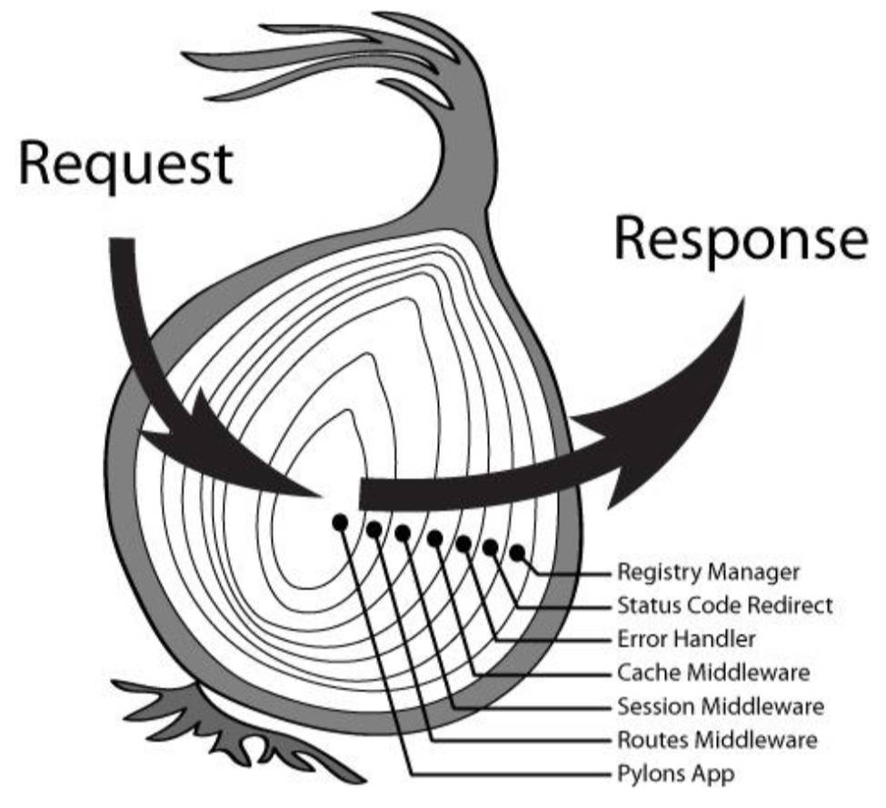

# 一、Koa 静态资源服务器

koa 并没有内置部署相关的功能；

安装一个第三方库 [static](https://github.com/koajs/static)

```shell
npm install koa-static
```

部署的过程类似于 express：

07-Node 服务器-Loa\07-koa 静态资源服务器.js

```js
const Koa = require('koa')
const static = require('koa-static')

// 创建 Koa 服务器
const app = new Koa()

app.use(static('./uploads'))
app.use(static('./build'))

// 开启 Koa 服务器
app.listen(9000, () => {
  console.log('koa 服务器启动成功~')
})
```

# 二、Koa 响应数据结果

响应输出结果时：可将 body 响应主体，设置为以下之一：

- string：字符串数据。
- Buffer：Buffer 数据。
- Stream：流数据。
- Object | Array：对象或者数组。
- null：不输出任何内容；

如果 `response.status` 尚未设置，Koa 会自动将状态设置为 `200` 或 `204`。

请求状态 status：

07-Node 服务器-Loa\08-koa 响应结果.js

```js
const fs = require('fs')
const Koa = require('koa')
const KoaRouter = require('@koa/router')

// 创建 Koa 服务器
const app = new Koa()

// 创建路由对象
const userRouter = new KoaRouter({ prefix: '/users' })

// 在路由中，注册中间件
userRouter.get('/', (ctx, next) => {
  // 1.body 类型设置为 string
  // ctx.body = 'user list data~'

  // 2.body 的类型是 buffer
  // ctx.body = Buffer.from('你好啊，李银河~')
  // 浏览器中，会将返回的结果，作为一个文件下载下来。
  // postman 会将返回的是 buffer / stream 类型，自动使用 utf8 解码。并直接展示

  // 3.body 的类型是 stream
  // 设置返回的 stream 的类型，默认是文本类型，设置为 image/jpeg，表示图片。
  // 一般不用这么做，部署静态资源服务器即可。
  // const readStream = fs.createReadStream('./uploads/1668331072032_kobe02.png')
  // ctx.type = 'image/jpeg'
  // ctx.body = readStream
  // postman，浏览器中，直接展示图片，相当于访问静态资源。

  // 4.body 的类型是数据 object | array，用的最多。
  ctx.status = 201
  ctx.body = {
    code: 0,
    data: [
      { id: 111, name: 'iphone', price: 999 },
      { id: 112, name: 'xiaomi', price: 666 }
    ]
  }

  // 5.body 的值是 null
  // ctx.body = null
})

// 注册路由
app.use(userRouter.routes())
app.use(userRouter.allowedMethods())

// 开启 Koa 服务器
app.listen(9000, () => {
  console.log('koa 服务器启动成功~')
})
```

`ctx.response.body` 和 `ctx.body` 是一样的。

# 三、koa 错误信息处理

在一个中间件中，完成错误处理：

07-Node 服务器-Loa\09-koa 错误处理.js

```js
const Koa = require('koa')
const KoaRouter = require('@koa/router')

// 创建 Koa 服务器
const app = new Koa()

// 创建路由对象
const userRouter = new KoaRouter({ prefix: '/users' })

// 在路由中，注册中间件
userRouter.get('/', (ctx, next) => {
  const isAuth = false

  if (isAuth) {
    ctx.body = 'user list data~'
  } else {
    ctx.body = {
      code: -1003,
      msg: '未授权的 token~'
    }
  }
})

// 注册路由
app.use(userRouter.routes())
app.use(userRouter.allowedMethods())

// 开启 Koa 服务器
app.listen(9000, () => {
  console.log('koa 服务器启动成功~')
})
```

为了优雅，简洁的进行错误处理，通常将错误处理的代码，统一放在一处进行处理。

但是，Koa 中间件中，`next` 函数不接受参数。

而是要使用 `ctx.app`（就是 koa 创建服务器，返回的 `app` 对象），本质上是一个 EventEmiter

- 产生错误时，可发送一个 `“error”` 事件，并传递错误码和 `ctx` 对象。
- 使用 app 监听 `“error”` 事件，在一个单独的回调函数中，处理错误。

07-Node 服务器-Loa\09-koa 错误处理.js

```js
const Koa = require('koa')
const KoaRouter = require('@koa/router')

// 创建 Koa 服务器
const app = new Koa()

// 创建路由对象
const userRouter = new KoaRouter({ prefix: '/users' })

// 在路由中，注册中间件
userRouter.get('/', (ctx, next) => {
  const isAuth = false

  if (isAuth) {
    ctx.body = 'user list data~'
  } else {
    ctx.app.emit('error', -1003, ctx)
  }
})

// 注册路由
app.use(userRouter.routes())
app.use(userRouter.allowedMethods())

app.on('error', (code, ctx) => {
  const errCode = code
  let msg = ''
  switch (errCode) {
    case -1001:
      msg = '帐号或密码错误~'
      break
    case -1002:
      msg = '请求参数不正确~'
      break
    case -1003:
      msg = '未授权的请求，请检查token是否正确~'
    default:
      break
  }

  ctx.body = {
    code,
    msg
  }
})

// 开启 Koa 服务器
app.listen(9000, () => {
  console.log('koa 服务器启动成功~')
})
```

> 【补充】：chrome 浏览器，不建议访问一些特殊的端口，其中包括 `6000` 端口。

# 四、Koa 和 express 的区别（面试）

从架构设计上来说：

express 是完整和强大的，其中帮助我们内置了非常多好用的功能；

> 【补充】：就像 Vue2 中可以使用 Vue 实例作为事件总线。早期的 Vue，还封装了自己的网络请求。

koa 是简洁和自由的，它只包含最核心的功能，并不会对使用的其他中间件进行任何限制。

- 甚至是在 `app` 中连最基本的 `get`、`post` 方法，都没有提供；
- 需要通过 `ctx` 来判断请求方式和请求路径。

express 和 koa 框架，核心都是中间件，核心区别，也在于中间件的使用：

它们的中间件的执行机制，是不同的，特别是针对某个中间件中，包含异步操作时；

express 和 koa 中间件的执行顺序分析；

koa 中的中间件：

- 在执行同步代码时，在上一个中间件中，只要调用 `next` 方法，就会执行下一个中间件的代码，之后再执行上一个中间件中 `next` 方法后面的代码。
- 在执行异步代码时，在上一个中间件中，只要调用 `next` 方法，就会执行下一个中间件的代码，如果这些代码是异步操作，默认不会等到异步代码的结果。如果需要等待结果，再执行上一个中间件 `next` 函数后的代码，那么，该 `next` 函数前，加 `await`。

> 【回顾】：async await 异步函数的原理，生成器。

express 中间件：

- 在执行同步代码时，与 koa 没有区别。
- 在执行异步代码时，`next` 函数返回的不是 Promise，使用 `await`；是无效的（**核心区别**）：
  - express 框架设计的初衷，就是同步执行代码，并返回结果，没有考虑异步。
  - 如果执行了异步操作，无法在上一个中间件的 `next` 方法调用后，取到异步结果。

express 执行同步代码：

08-koa 和 express 的区别\02_express 中间件-执行异步.js

```js
const express = require('express')

const app = express()

app.use((req, res, next) => {
  console.log('express middleware 1')
  req.msg = 'aaa' // 1
  next()
  res.json(req.msg) // 5
})

app.use((req, res, next) => {
  console.log('express middleware 2')
  req.msg += 'bbb' // 2
  next()
  res.msg += 'ddd' // 4
})

app.use((req, res, next) => {
  console.log('express middleware 3')
  req.msg += 'ccc' // 3
})

app.listen(9000, () => {
  console.log('express 服务器启动成功了')
})

// 客户端接收到的返回结果 "aaabbbcccddd"
```

Koa 执行同步代码：

08-koa 和 express 的区别\03-koa 中间件-执行同步.js

```js
const Koa = require('koa')

// 创建 app 对象
const app = new Koa()

// 注册中间件
app.use((ctx, next) => {
  console.log('koa middleware01')
  ctx.msg = 'aaa' // 1
  next()

  // 返回结果
  ctx.body = ctx.msg // 5
})

app.use((ctx, next) => {
  console.log('koa middleware02')
  ctx.msg += 'bbb'// 2
  next()
  ctx.msg += 'ddd' // 4
})

app.use((ctx, next) => {
  console.log('koa middleware03')
  ctx.msg += 'ccc'// 3
})


// 启动服务器
app.listen(9000, () => {
  console.log('koa服务器启动成功~')
})

// 客户端返回的结果："aaabbbcccddd"
```

express 执行异步代码：

08-koa 和 express 的区别\02_express 中间件-执行异步.js

```js
const express = require('express')
const axios = require('axios')

// 创建 app 对象
const app = express()

// 编写中间件
app.use(async (req, res, next) => {
  console.log('express middleware01')
  req.msg = 'aaa'
  await next() // 在这里，await 是无效的；express 中，next 返回的不是 Promise。
  // 返回值结果
  // res.json(req.msg) 在这里返回结果，下方中间件中的 axios.get 异步操作还没执行。
})

app.use(async (req, res, next) => {
  console.log('express middleware02')
  req.msg += 'bbb'
  await next() // 在这里，await 是无效的；express 中，next 返回的不是 Promise。
})

// 执行异步代码
app.use(async (req, res, next) => {
  console.log('express middleware03')
  const resData = await axios.get('http://123.207.32.32:8000/home/multidata')
  req.msg += resData.data.data.banner.list[0].title

  // 只能在这里（异步操作有结果后）返回响应结果，才将上方异步操作结果，放入执行后，返回的。
  res.json(req.msg)
})

// 启动服务器
app.listen(9000, () => {
  console.log('express服务器启动成功~')
})

// 客户端接收返回的结果："aaabbb焕新女装节"
```

Koa 执行异步代码：

08-koa 和 express 的区别\04_koa 中间件-执行异步.js

```js
const Koa = require('koa')
const axios = require('axios')

// 创建 app 对象
const app = new Koa()

// 注册中间件
// 1.koa 的中间件1
app.use(async (ctx, next) => {
  console.log('koa middleware01')
  ctx.msg = 'aaa'
  await next()

  // 返回结果
  ctx.body = ctx.msg
})

// 2.koa 的中间件2
app.use(async (ctx, next) => {
  console.log('koa middleware02')
  ctx.msg += 'bbb'
  // 如果执行的下一个中间件，是一个异步函数, 那么 next 默认不会等到中间件的结果, 就会执行下一步操作
  // 如果希望等待下一个异步函数的执行结果, 那么需要在 next 函数前面加 await；
  await next()
  console.log('----')
})

// 3.koa 的中间件3
app.use(async (ctx, next) => {
  console.log('koa middleware03')
  // 网络请求
  const res = await axios.get('http://123.207.32.32:8000/home/multidata')
  ctx.msg += res.data.data.banner.list[0].title
})

// 启动服务器
app.listen(9000, () => {
  console.log('koa服务器启动成功~')
})
```

# 五、koa 洋葱模型（面试）

洋葱模型，是由社区总结的，用于形象地描述 koa 框架的模型，它两层理解含义：

- 中间件处理代码的过程；
- Response 返回 body 执行的过程；

下列三种情况，适用于洋葱模型：

- Koa 执行同步；
- koa 执行异步代码（要用 `await next()`）；
- express 执行同步代码时。

express 执行异步代码时，不适用洋葱模型。



# 六、express 源码理解

使用 VSCode 自带的 debug，打断点进行调试。

express 创建服务器的过程。

源码中，`http.createServer(this)`, `this` 指得就是 `app`；

`app.use(callback)`, 本质上在做的事：

- `callback` 保存在数组中，监听网络请求，
- 根据网络请求，在数组中匹配路径和方法，如果调用 `next`，执行下一个 `callback`。

`app.use` 默认会有一个路由，是整个 `app` 的路由。

将路径，中间件保存在 layer 中，layer 放在 `router.stack` 中，当监听到请求时，进行匹配。

