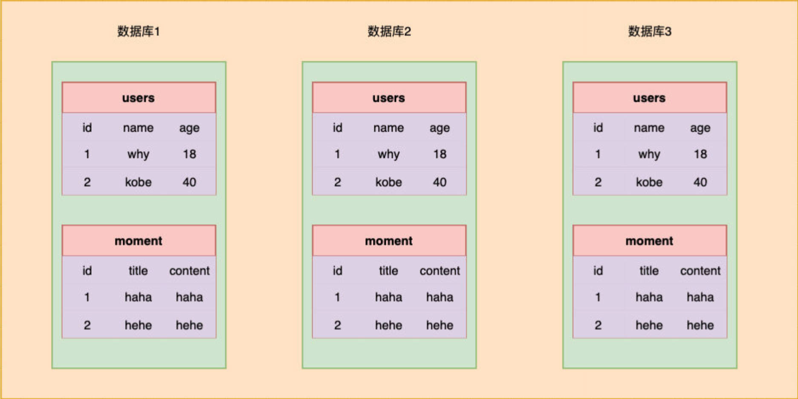

# 一、Koa 源码分析

Koa 导出的是一个类，名为 `Application`，用它可创建出实例 `app`。

中间件会保存在 `this.middleware` 中；每一个添加的中间件，都被 `push` 到其中。

执行 `app.listen` 方法，传入的是 `this.callback()` 的返回值。

在 `handleRequest` 函数中，定义了 `onerror`，`handleResponse`，在返回的 Promise 后，`.then(handleResponse).catch(onerror)`

执行 `next` 函数，本质上是在执行 `dispatch` 函数。

`dispatch` 会返回一个 Promise

# 二、数据库的概念

数据库与后端开发，就像 redux 与 react 框架的关系。

所有的开发，不管是前端，后端，大数据，人工智能...都是对数据的处理。

## 1.为什么需要

任何的软件系统，都需要存放大量的数据，这些数据通常是非常复杂和庞大的：

- 比如用户信息包括：姓名、年龄、性别、地址、身份证号、出生日期、等等；
- 比如商品信息包括商品的：名称、描述、价格（原价）、分类标签、商品图片、等等；
- 比如歌曲信息包括歌曲的：名称、歌手、专辑、歌曲时长、歌词信息、封面图片、等等；

这些信息，不能直接存储到文件中吗？可以，但是文件系统有很多的缺点：

- 很难以合适的方式组织数据（数据库中，多张表之前的关系组织合理）；
- 对数据进行：增、删、改、查，中的复杂操作，并且保证单操作的**原子性**（不能同时被修改）；
- 一个数据库，需要为多个程序服务，文件很难进行数据共享；
- 需要考虑如何进行数据的高效备份、迁移、恢复；
- 等等...

## 2.是什么

数据库通俗来讲就是一个存储数据的仓库；

数据库本质上就是一个软件、一个程序。

# 三、常见的数据库

通常将数据库划分成两类：**关系型数据库**和**非关系型数据库**；

**关系型数据库**有：MySQL、Oracle、DB2、SQL Server、Postgre SQL 等；

- 通常会创建很多个二维数据表；
- 数据表之间，相互关联起来，形成**一对一**、**一对多**、**多对多**等关系；
- 利用 SQL 语句，在多张表中查询所需的数据；

**非关系型数据库**有：MongoDB、Redis、Memcached、HBse 等；

- 英文全称，其实是：“Not only SQL”，即：“不仅仅是关系型数据库”，也简称为 NoSQL；
- 相对比较简单，存储数据也会更加自由（甚至可以将一个复杂的 json 对象直接塞入到数据库中）；
- NoSQL 是基于 Key-Value 的对应关系，并且查询的过程中，不需要经过 SQL 解析；

如何在开发中选择他们呢？具体的选择，根据不同的项目进行综合的分析：

- 目前在公司进行后端开发（Node、Java、Go 等），还是以**关系型数据库**为主；
- 用到**非关系型数据库**，在爬取大量的数据，或收集大量无固定结构的数据时，会比较方便；

**非关系型数据库**，相较于**关系型数据库**

- 存储的形式随意简单。
- 不好进行精确地细化地操作。
- 通常会有大量冗余信息。

# 四、MySQL 是什么？

MySQL 原本是一个开源的数据库，原开发者为瑞典的 MySQL AB 公司；

在 2008 年被 Sun 公司收购；

在 2009 年，Sun 被 Oracle 收购；

所以目前 MySQL 归属于 Oracle；

MySQL 是一个关系型数据库，其实本质上就是一款软件、一个程序：

- 这个程序中，管理着多个数据库；
- 每个数据库中，可以有多张表；
- 每个表中，可以有多条数据；

数据组织方式：



# 五、MySQL 下载

[下载地址](https://dev.mysql.com/downloads/mysql/)，根据自己的操作系统，下载即可；

Windows 推荐下载 MSI 的版本，不用做多余的配置；

Mac 推荐下载 DMG 的版本；在安装过程中会配置一些环境变量；

安装最新的版本即可（目前是 8.0.31）：安装完成后，

- 默认创建了一个名为 root 的用户。
- 需要自行配置该用户的密码。

打开 MySQL 命令行工具。输入配置的密码，即可使用 root 用户，连接到 MySQL.

如果想要在全局命令行，为 MySQL，配置环境变量。

# 六、终端连接数据库

想要操作数据，先和数据建立一个连接；

最直接的方式，就是通过终端来连接；

有两种方式来连接：区别在于，是直接输入密码，还是另起一行以密文的形式输入；

方式一：

```mysql
mysql -uroot -p[password]
```

方式二：

```mysql
mysql -uroot -p

Enter password: [your password]
```

一个数据库软件中，可以包含很多个数据库，显示数据库：

```mysql
SHOW DATABASES;
```

MySQL 默认存在的数据库有：

- `information_schema`：信息数据库，其中包括 MySQL 在维护的其他数据库、表、列、访问权限等信息；

- `performance_schema`：性能数据库，记录着 MySQL Server 数据库引擎在运行过程中的一些资源消耗相关的信息；

- `mysql`：用于存储数据库管理者的用户信息、权限信息以及一些日志信息等；
- `sys`：相当于是一个简易版的 performance_schema，将性能数据库中的数据汇总成更容易理解的形式；

# 七、终端操作数据库

在终端创建一个属于自己的新的数据库 `music_db`（一般情况下一个新的项目，会对应一个新的数据库）。

```mysql
CREATE DATABASE music_db;
```

使用该创建的数据库：

```mysql
USE music_db;
```

在该数据库中，创建一张表 `user`：

```mysql
INSERT TABLE user (
  name varchar(20),
  age int,
  height double
);
```

在该表中，在插入数据：

```mysql
INSERT INTO user (
  name,
  age,
  height
) values (
  'zzt',
  18,
  1.88
);

INSERT INTO user (
  name,
  age,
  height
) values (
  'kobe',
  40,
  1.98
);
```

> MySQL 命令，只要不写分号，就可以换行。

# 八、GUI 工具介绍

在终端操作数据库，有很多不方便的地方：

- 语句没有高亮，没有任何的提示；
- 复杂语句分行，格式不美观，容易出错；
- 查看数据库或表，不直观、不方便；
- 等等...

在实际开发中，可以借助于一些 GUI 工具，来连接数据库，在 GUI 工具中操作就会非常方便。

常见的 MySQL 的 GUI 工具有很多，这里推荐几款：

- _Navicat_：个人最喜欢的一款工作，但是是收费的（有免费的试用时间）；
- _SQLYog_：一款免费的 SQL 工具；
- _TablePlus_：常用功能都可以使用，但是会多一些限制（比如只能开两个标签页）；

下载 Navicat 工具。

连接数据库软件 MySQL；

选择刚刚创建的数据库 `music_db`，新建查询。

可以将写下的 SQL 语句，保存一个 .sql 文件；

# 九、SQL 语句是什么？

我们希望操作数据库（特别是在程序中），就需要有和数据库沟通的语言，这个语言就是 SQL：

SQL 是"Structured Query Language"，称之为结构化查询语言，简称 SQL；

使用 SQL 编写出来的命令语句，就称之为 SQL 语句；

SQL 语句可以用于对数据库进行操作；

常见的关系型数据库 SQL 语句，都是比较相似的；

SQL 语句的常用规范：

- 关键字通常使用大写，比如 `CREATE`、`TABLE`、`SHOW`、等等；
- 一条语句结束后，需要以 `;` 结尾；
- 如果遇到关键字作为表名或者字段名称，要使用 `` 包裹;

# 十、SQL 语句分类

常见的 SQL 语句，可以分成四类：

**DDL（Data Definition Language）**：数据定义语言；

- 对数据库或者表，进行创建、删除、修改等操作；

**DML（Data Manipulation Language）**：数据操作语言；

- 对表中数据进行：添加、删除、修改等操作；

**DQL（Data Query Language）**：数据查询语言；

- 从数据库中查询记录；**（重点）**

**DCL（Data Control Language）**：数据控制语言；

- 对数据库、表的权限进行相关访问控制操作；

# 十一、查看数据库

查看所有的数据：

```mysql
SHOW DATABASES;
```

使用某一个数据：

```mysql
USE muisc_db;
```

查看当前正在使用的数据库：

```mysql
SELECT DATABASE();
```

# 十二、DDL 语句

## 1.创建数据库

```mysql
# 创建数据库
CREATE DATABASE bilibili;

# 创建一个已存在的数据库，会报错，使用更安全的命令。
CREATE DATABASE IF NOT EXISTS bilibili;

# 创建数据库，并设置编码，一般使用默认编码即可。
CREATE DATABASE IF NOT EXISTS bilibili
  DEFAULT CHARACTER SET utf8mb4 COLLATE utf8mb4_0900_ai_ci;
```

## 3.删除数据库

```mysql
# 删除数据库
DROP DATABASE bilibili;

# 删除一个不存在的数据库，会报错，使用更安全的命令。
DROP DATABASE IF EXIT bilibili;
```

## 4.修改数据库

```mysql
# 修改数据库的字符集编码和排序规则，但一般使用默认的。
ALTER DATABASE bilibili CHARACTER SET = utf8 COLLATE = utf8_unicode_ci;
```
