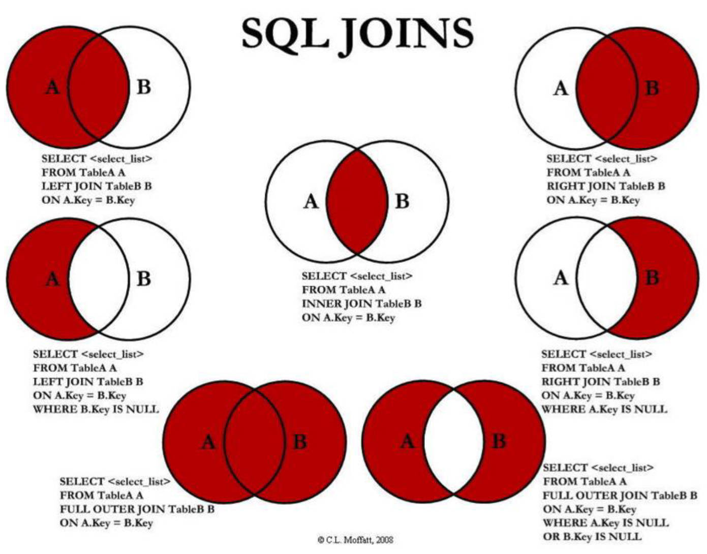
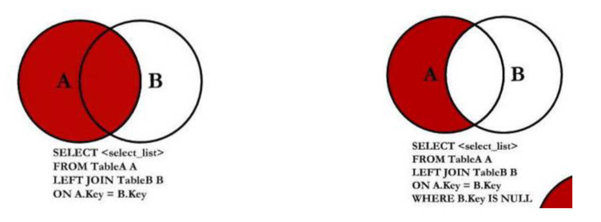
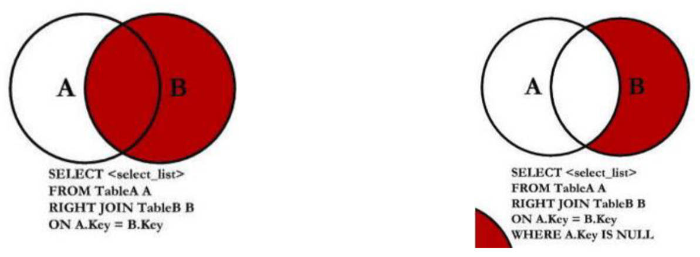

# 一、聚合函数

有哪些聚合函数？详见[官方文档](https://dev.mysql.com/doc/refman/8.0/en/aggregate-functions.html)

| Name                                                         | Description                                      |
| :----------------------------------------------------------- | :----------------------------------------------- |
| [`AVG()`](https://dev.mysql.com/doc/refman/8.0/en/aggregate-functions.html#function_avg) | Return the average value of the argument         |
| [`BIT_AND()`](https://dev.mysql.com/doc/refman/8.0/en/aggregate-functions.html#function_bit-and) | Return bitwise AND                               |
| [`BIT_OR()`](https://dev.mysql.com/doc/refman/8.0/en/aggregate-functions.html#function_bit-or) | Return bitwise OR                                |
| [`BIT_XOR()`](https://dev.mysql.com/doc/refman/8.0/en/aggregate-functions.html#function_bit-xor) | Return bitwise XOR                               |
| [`COUNT()`](https://dev.mysql.com/doc/refman/8.0/en/aggregate-functions.html#function_count) | Return a count of the number of rows returned    |
| [`COUNT(DISTINCT)`](https://dev.mysql.com/doc/refman/8.0/en/aggregate-functions.html#function_count-distinct) | Return the count of a number of different values |
| [`GROUP_CONCAT()`](https://dev.mysql.com/doc/refman/8.0/en/aggregate-functions.html#function_group-concat) | Return a concatenated string                     |
| [`JSON_ARRAYAGG()`](https://dev.mysql.com/doc/refman/8.0/en/aggregate-functions.html#function_json-arrayagg) | Return result set as a single JSON array         |
| [`JSON_OBJECTAGG()`](https://dev.mysql.com/doc/refman/8.0/en/aggregate-functions.html#function_json-objectagg) | Return result set as a single JSON object        |
| [`MAX()`](https://dev.mysql.com/doc/refman/8.0/en/aggregate-functions.html#function_max) | Return the maximum value                         |
| [`MIN()`](https://dev.mysql.com/doc/refman/8.0/en/aggregate-functions.html#function_min) | Return the minimum value                         |
| [`STD()`](https://dev.mysql.com/doc/refman/8.0/en/aggregate-functions.html#function_std) | Return the population standard deviation         |
| [`STDDEV()`](https://dev.mysql.com/doc/refman/8.0/en/aggregate-functions.html#function_stddev) | Return the population standard deviation         |
| [`STDDEV_POP()`](https://dev.mysql.com/doc/refman/8.0/en/aggregate-functions.html#function_stddev-pop) | Return the population standard deviation         |
| [`STDDEV_SAMP()`](https://dev.mysql.com/doc/refman/8.0/en/aggregate-functions.html#function_stddev-samp) | Return the sample standard deviation             |
| [`SUM()`](https://dev.mysql.com/doc/refman/8.0/en/aggregate-functions.html#function_sum) | Return the sum                                   |
| [`VAR_POP()`](https://dev.mysql.com/doc/refman/8.0/en/aggregate-functions.html#function_var-pop) | Return the population standard variance          |
| [`VAR_SAMP()`](https://dev.mysql.com/doc/refman/8.0/en/aggregate-functions.html#function_var-samp) | Return the sample variance                       |
| [`VARIANCE()`](https://dev.mysql.com/doc/refman/8.0/en/aggregate-functions.html#function_variance) | Return the population standard variance          |

聚合函数表示对值的集合 进行操作的组（集合）函数。

```mysql
# 华为手机价格的平均值
SELECT AVG(price) FROM `products` WHERE brand = '华为';

# 计算所有手机的平均分
SELECT AVG(score) as miAvgScore FROM `products` WHERE brand = '小米';

# 手机中最低和最高分数
SELECT MAX(score) FROM `products`;
SELECT MIN(score) FROM `products`;

# 计算总投票人数
SELECT SUM(voteCnt) FROM `products`;

# 计算所有条目的数量
SELECT COUNT(*) FROM `products`;

# 华为手机的个数
SELECT COUNT(*) FROM `products` WHERE brand = '华为';
```

一般用 `COUNT(*)`，而不是 `COUNT([某一个字段])` 来计算记录i总数，。

后续介绍：

- 评分最高的值，属于那部手机？需要用到子查。
- 聚合函数直接转对象，数组。

# 二、GROUP BY

前面介绍的聚合函数，相当于默认将所有的数据分成了一组：
- 比如 `AVG()`、`MAX()`...，都是将所有的结果看成一组来计算的；

那么如果希望划分多个组：比如华为、苹果、小米、等等手机分别的平均价格，应该怎么来做呢？

这个时候我们可以使用 `GROUP BY`；它通常和聚合函数一起使用：

表示我们先对数据进行分组，再对每一组数据，进行聚合函数的计算；

我们现在来提一个需求：
- 根据品牌进行分组；
- 计算各个品牌中：商品的个数、平均价格；
- 也包括：最高价格、最低价格、平均评分；

```mysql
SELECT
	brand, MAX(price) AS maxPrice,
	MIN(price) AS minPrice,
	ROUND(AVG(price), 2) avgPrice,
	AVG(score) avgScore
FROM `products`
GROUP BY brand;
```

`ROUND()` 函数，用于保留几位小数的函数。

## 1.约束条件 HAVING

如果希望给 `Group By` 查询到的结果，添加一些约束，那么可以使用：`HAVING`。

通常 `GROUP BY` 和 `HAVING` 一起使用。

比如：如果我们还希望筛选出平均价格在 `4000` 以下，并且平均分在 `7` 以上的品牌：

```mysql
SELECT
	brand, MAX(price) AS maxPrice,
	MIN(price) AS minPrice,
	ROUND(AVG(price), 2) avgPrice,
	AVG(score) avgScore
FROM `products`
GROUP BY brand
HAVING avgScore > 7 AND avgPrice > 4000;
```

# 三、多张表

设想，上面的商品表中，对应的品牌还需要包含其他的信息：
- 比如品牌的官网，品牌的世界排名，品牌的市值...；

如果直接在商品表中，去体现品牌相关的信息，会存在一些问题：
- 一方面，`products` 表中，应该仅用于表示商品相关的数据；
- 另一方面，多个商品使用的品牌是一致时，会存在大量的冗余数据。

所以，应将所有的品牌数据，单独放到一张表中，创建一张品牌表 `brand`：

```mysql
-- 创建一张品牌表 brand
CREATE TABLE IF NOT EXISTS `brands`(
	id INT PRIMARY KEY AUTO_INCREMENT,
	name VARCHAR(10) UNIQUE NOT NULL,
	website VARCHAR(100),
	worldRank INT
);
```

插入模拟数据；

注意，并非完全对应的关系，

- 刻意有一些商品数据的品牌，是没有添加的；并且也可以添加了一些不存在的手机品牌；
- 实际开发中，经常要处理类似于这样的情况。

```mysql
INSERT INTO `brands` (name, website, worldRank) VALUES ('华为', 'www.huawei.com', 1);
INSERT INTO `brands` (name, website, worldRank) VALUES ('小米', 'www.mi.com', 10);
INSERT INTO `brands` (name, website, worldRank) VALUES ('苹果', 'www.apple.com', 5);
INSERT INTO `brands` (name, website, worldRank) VALUES ('oppo', 'www.oppo.com', 15);
INSERT INTO `brands` (name, website, worldRank) VALUES ('京东', 'www.jd.com', 3);
INSERT INTO `brands` (name, website, worldRank) VALUES ('Google', 'www.google.com', 8);
```

## 1.外键的创建、关联

将两张表联系起来：

- 将 `products` 表中的 `brand` 字段，改为 `brand_id` 字段
- 将 `products` 表中的 `brandid` 字段，与 `brand` 表中的 `id` 字段关联。


创建外键约束时，分为两种情况：

情况一：创建表时；

```mysql
FOREIGN KEY (brand_id) REFERENCES brands(id)
```

情况二：修改以创建表时

- 当前演示的案例，属于这种情况:
- 在原 `products` 表上，添加 `brand_id` 字段，设置外键。

```mysql
ALTER TABLE `products` ADD `brand_id` INT;

ALTER TABLE `products` ADD FOREIGN KEY (brand_id) REFERENCES brands(id);
```

验证是否已经在 `brand_id` 字段上，添加了外键。

- 设计表，查看。
- 保存一个不符合外键约束的值。

## 2.外键的值关联

将 `products` 表中，`brand_id` 字段中的值，关联到 `brand` 表中，`id` 字段的值。

```mysql
UPDATE `products` SET `brand_id` = 1 WHERE `brand` = '华为';
UPDATE `products` SET `brand_id` = 4 WHERE `brand` = 'OPPO';
UPDATE `products` SET `brand_id` = 3 WHERE `brand` = '苹果';
UPDATE `products` SET `brand_id` = 2 WHERE `brand` = '小米';
```

vivo，oppo，锤子科技，没设置对应 id，开发中要处理这样的情况。

## 3.外键相关设置

外键存在时，修改和删除外键关联的字段值，外键字段的相关操作。

如果 `products` 表中，引用的外键被更新或者删除了，这个时候会出现什么情况呢？

比如：进行一个更新操作：将 `brand` 表中，华为的 id 更新为 99

这个时候执行代码是报错的：

```mysql
UPDATE `brand` SET id = 99 WHERE id = 1;
# Cannot delete or update a parent row: a foreign key constraint fails (`music_db`.`products`, CONSTRAINT `products_ibfk_1` FOREIGN KEY (`brand_id`) REFERENCES `brands` (`id`))
```

下面分析，外键存在时，修改和删除外键关联的字段值，外键字段的相关操作。

外键存在时，默认不能修改外键关联的字段值。

如果希望可以更新呢？需要修改外键 ON DELETE 或者 ON UPDATE 的值；

可以设置如下几个值：
- `RESTRICT`：（默认属性）：当更新或删除某个记录时，会检查该记录是否有关联的外键记录，有的话会报错的，不允许更新或 删除；
- `NO ACTION`：和 `RESTRICT` 是一致的，是社区 SQL 的标准（MySQL 也支持）。
- `CASCADE`：用的最多，当更新或删除某个记录时，会检查该记录是否有关联的外键记录，有的话： 
  - 更新：那么会更新对应的记录；
  - 删除：那么关联的记录会被一起删除掉；
- `SET NULL`：当更新或删除某个记录时，会检查该记录是否有关联的外键记录，有的话，将对应的值设置为 `NULL`；

设置步骤：

查看表 `products`。

```mysql
SHOW CREATE TABLE `products`;

# CREATE TABLE `products` (
#  `id` int NOT NULL AUTO_INCREMENT,
#  `brand` varchar(20) DEFAULT NULL,
#  `title` varchar(100) NOT NULL,
#  `price` double NOT NULL,
#  `score` decimal(2,1) DEFAULT NULL,
#  `voteCnt` int DEFAULT NULL,
#  `url` varchar(100) DEFAULT NULL,
#  `pid` int DEFAULT NULL,
#  `brand_id` int DEFAULT NULL,
#  PRIMARY KEY (`id`),
#  KEY `brand_id` (`brand_id`),
#  CONSTRAINT `products_ibfk_1` FOREIGN KEY (`brand_id`) REFERENCES `brands` (`id`)
#) ENGINE=InnoDB AUTO_INCREMENT=109 DEFAULT CHARSET=utf8mb4 COLLATE=utf8mb4_0900_ai_ci
```

找到了外键 `products_ibfk_1`，

删除该外键。

```mysql
ALTER TABLE `products` DROP FOREIGN KEY products_ibfk_1;
```

重新添加外键，设置 `ON UPDATA`、`ON DELETE` 为 `CASCADE`。

```mysql
ALTER TABLE `products` ADD FOREIGN KEY (brand_id) REFERENCES brands(id)
											 ON UPDATE CASCADE
											 ON DELETE CASCADE;
```

# 四、多表查询

如果希望，在查询到产品的同时，显示对应的品牌相关的信息，

因为数据是存放在两张表中，所以这个时候就需要进行多表查询。 

默认多表查询的结果。直接通过查询语句，在多张表中，查询到数据，这个时候是什么效果呢？

- 查询的结果中，总记录数 = `products` 表中记录数 * `brands` 表中记录数；
- 也就是说，`products` 表中每一个条数据，都会和 `brands` 表中的每一条数据结合一次；
- 这个结果我们称之为 **笛卡尔乘积**，也称之为**直积**，表示为 `X*Y`

```mysql
SELECT * FROM `products`, `brands`;
```

使用 `WHERE` 查询条件，对结果进行筛选。

- 但是过滤后，部分数据丢失了，因为只能过滤满出足条件的数据。原表中外键值为 `NULL` 的数据，丢失了。

```mysql
SELECT * FROM `products`, `brands` WHERE products.brand_id = brands.id;
```

我们想要的效果，并不是以上两条 SQL 语句执行的效果。

这个时候，就要使用 **SQL JOIN** 操作，即**多表连接**。



## 1.左连接（常用）

在多表查询时，使用 SQL JOINS 操作，希望获取到的，是左边所有的数据（以左表为主）： 

此时，无论左边的表（`products` 表）中，`brand_id` 字段是否有对应右边表（`brands` 表）中 的 `id `字段；

左边的数据都会被查询出来；

左连接的完整写法是：`LEFT [OUTER] JOIN`，`OUTER` 可以省略的；

```mysql
SELECT * FROM `products` LEFT JOIN `brands` ON products.brand_id = brands.id;
```


使用左连接，查询没有交集的数据。

```mysql
SELECT * FROM `products` LEFT JOIN `brands` ON products.brand_id = brands.id WHERE brands.id IS NOT NULL;
```



## 2.右链接

在多表查询时，使用 SQL JOINS 操作，希望获取到的，是右边所有的数据（以右表为主）： 

此时，无论左边的表（`products` 表）中的 `brand_id` 字段，是否有和右边表（`brands` 表）中的 `id` 对应，

右边的数据都会被查询出来；

它的完整写法是 `RIGHT [OUTER] JOIN`，`OUTER` 可以省略的；

```mysql
SELECT * FROM `products` RIGHT JOIN `brands` ON products.brand_id = brands.id;
```

使用右连接，查询没有交集的数据。

```mysql
SELECT * FROM `products` RIGHT JOIN `brands` ON products.brand_id = brands.id WHERE products.brand_id IS NOT NULL;
```



## 3.内连接（常用）

事实上，内连接是表示，左边的表，和右边的表，都有对应的数据关联： 

内连接有其他的写法：`CROSS JOIN`、`INNER JOIN` 或者 `JOIN` 都可以；

```mysql
SELECT * FROM `products` INNER JOIN `brands` ON `products`.brand_id = `brands`.id;
```

会发现，它和如下，之前的写法，效果是一样的：去掉了外键值为空的数据，

```mysql
SELECT * FROM `products`, `brands` WHERE products.brand_id = brands.id;
```

但是他们代表的含义并不相同： 
- SQL 语句一：内连接，代表的是在两张表连接时，就会约束数据之间的关系，来决定之后查询的结果；
- SQL 语句二：`WHERE` 条件，代表的是先计算出笛卡尔乘积，再进行 `WHERE` 条件的帅选；


## 4.全连接

SQL 规范中，全连接使用 `FULL JOIN`，但是 MySQL 中并没有对它的支持；

需要使用 `UNION` 来实现：

```mysql
(SELECT * FROM `products` LEFT JOIN `brands` ON products.brand_id = brands.id)
UNION
(SELECT * FROM `products` RIGHT JOIN `brands` ON products.brand_id = brands.id);

(SELECT * FROM `products` LEFT JOIN `brands` ON products.brand_id = brands.id WHERE brands.id IS NULL)
UNION
(SELECT * FROM `products` RIGHT JOIN `brands` ON products.brand_id = brands.id WHERE products.id IS NULL);	
```


# 五、多对多关系

在开发中，我们还会遇到多对多的关系： 

比如：学生可以选择多门课程，一个课程可以被多个学生选择； 

处理这种情况，通常会建立一张关系表（这也可以看作是一个分层架构）。

## 1.数据准备：

创建学生表 `students`，并插入数据；创建科目表 `course` 并插入数据；

```mysql
-- 创建学生表，并插入数据
CREATE TABLE IF NOT EXISTS `students`(
  id INT PRIMARY KEY AUTO_INCREMENT,
  name VARCHAR(20) NOT NULL,
  age INT
);
INSERT INTO `students` (name, age) VALUES('zzt', 18);
INSERT INTO `students` (name, age) VALUES('tom', 22);
INSERT INTO `students` (name, age) VALUES('lilei', 25);
INSERT INTO `students` (name, age) VALUES('lucy', 16);
INSERT INTO `students` (name, age) VALUES('lily', 20);


-- 创建课程表，并插入数据
CREATE TABLE IF NOT EXISTS `courses`(
  id INT PRIMARY KEY AUTO_INCREMENT,
  name VARCHAR(20) NOT NULL,
  price DOUBLE NOT NULL
);
INSERT INTO `courses` (name, price) VALUES ('英语', 100);
INSERT INTO `courses` (name, price) VALUES ('语文', 666);
INSERT INTO `courses` (name, price) VALUES ('数学', 888);
INSERT INTO `courses` (name, price) VALUES ('历史', 80);
INSERT INTO `courses` (name, price) VALUES ('物理', 100);
```

在 `students` 表和 `course` 表之间；

创建关系表。建立外键联系。

```mysql
# 创建关系表
CREATE TABLE IF NOT EXISTS `students_select_courses`(
	id INT PRIMARY KEY AUTO_INCREMENT,
	student_id INT NOT NULL,
	course_id INT NOT NULL,
	FOREIGN KEY (student_id) REFERENCES students(id) ON UPDATE CASCADE ON DELETE CASCADE,
	FOREIGN KEY (course_id) REFERENCES courses(id) ON UPDATE CASCADE ON DELETE CASCADE
);
```

在关系表 `students_select_courses` 中，插入数据：

```mysql
# zzt 选修了 英文和数学
INSERT INTO `students_select_courses` (student_id, course_id) VALUES (1, 1);
INSERT INTO `students_select_courses` (student_id, course_id) VALUES (1, 3);

# lilei 选修了 语文和数学和历史
INSERT INTO `students_select_courses` (student_id, course_id) VALUES (3, 2);
INSERT INTO `students_select_courses` (student_id, course_id) VALUES (3, 3);
INSERT INTO `students_select_courses` (student_id, course_id) VALUES (3, 4);
```

## 2.查询数据（多对多）：

查询：有选课的学生，的选课情况（内连接）。

```mysql
SELECT
  stu.name stuName, stu.age stuAge, cs.name csName, cs.price csPrice
FROM `students` stu
JOIN `students_select_courses` ssc
	ON stu.id = ssc.student_id
JOIN `courses` cs
	ON ssc.course_id = cs.id;
```

查询：所有的学生（不管有没有选课），的选课情况（左连接）

```mysql
SELECT
  stu.name stuName, stu.age stuAge, cs.name csName, cs.price csPrice
FROM `students` stu
LEFT JOIN `students_select_courses` ssc
	ON stu.id = ssc.student_id
LEFT JOIN `courses` cs
	ON ssc.course_id = cs.id;
```

查询：单个学生的选课情况（左连接）。

- 内连接，没有选课的学生选不出来，所以要用左连接

```mysql
SELECT
  stu.name stuName, stu.age stuAge, cs.name csName, cs.price csPrice
FROM `students` stu
LEFT JOIN `students_select_courses` ssc
	ON stu.id = ssc.student_id
LEFT JOIN `courses` cs
	ON ssc.course_id = cs.id
WHERE stu.name = 'zzt';
```

查询：哪些学生没有选课（左连接）。

```mysql
SELECT
	stu.name stuName, stu.age stuAge, cs.name csName, cs.price csPrice
FROM `students` stu
LEFT JOIN `students_select_courses` ssc
  ON stu.id = ssc.student_id
LEFT JOIN `courses` cs
  ON ssc.course_id = cs.id
WHERE cs.id IS NULL;
```

查看：哪些课程没有被选择（右链接）。

```mysql
SELECT
	stu.name stuName, stu.age stuAge, cs.name csName, cs.price csPrice
FROM `students` stu
RIGHT JOIN `students_select_courses` ssc
  ON stu.id = ssc.student_id
RIGHT JOIN `courses` cs
  ON ssc.course_id = cs.id
WHERE stu.id IS NULL;
```

